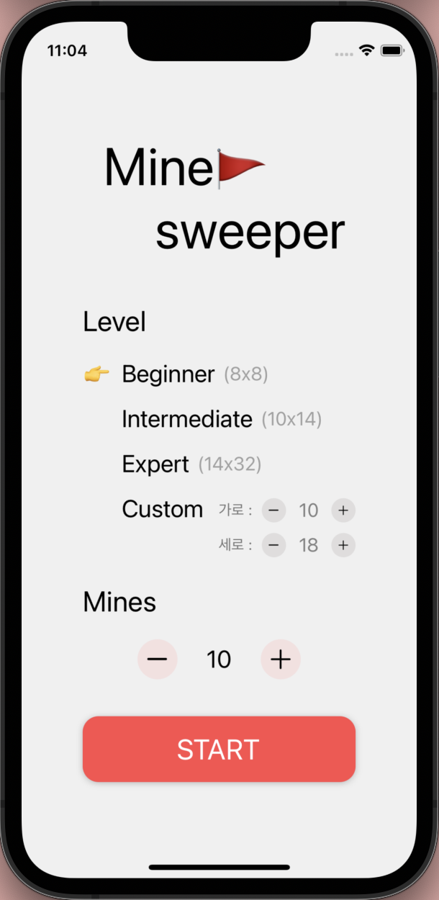
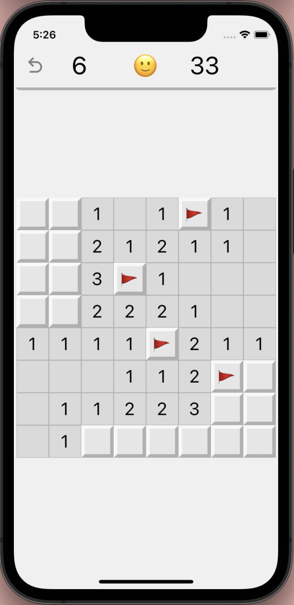

# 소개

| 개발자      | 장엄지                   |
| ----------- | ------------------------ |
| 기간        | 24.04.12 - 24.04.16 (약 1주)      |
| 인원         | 1명 |
| 역할 | 기획 및 디자인, 개발 |
| 기여도 | 100% |

###

# 설치 및 실행

1. 프로젝트를 다운받아 주세요.
2. node_modules를 설치해 주세요
   ```bash
   npm install
   ```
3. 프로젝트를 실행해 주세요.
   ```bash
   npx expo start
   ```
   - i : ios 에뮬레이터 실행
   - a : android 애뮬레이터 실행
   - r : 새로고침

###

# 구현 사항
- 난이도를 선택할 수 있습니다.
- 보드 크기, 지뢰 개수를 유저 마음대로 설정할 수 있습니다.
- 보드 칸을 길게 눌러 깃발을 꽂을 수 있습니다.
- 칸을 누르면 타이머가 시작됩니다.
- 게임이 종료되면 성공 여부, 걸린 시간, 플래깅 여부가 표시됩니다.

###

# 구현 화면

<details>
<summary>미리보기</summary>
<div markdown="1">       
  
  
</div>
</details>

